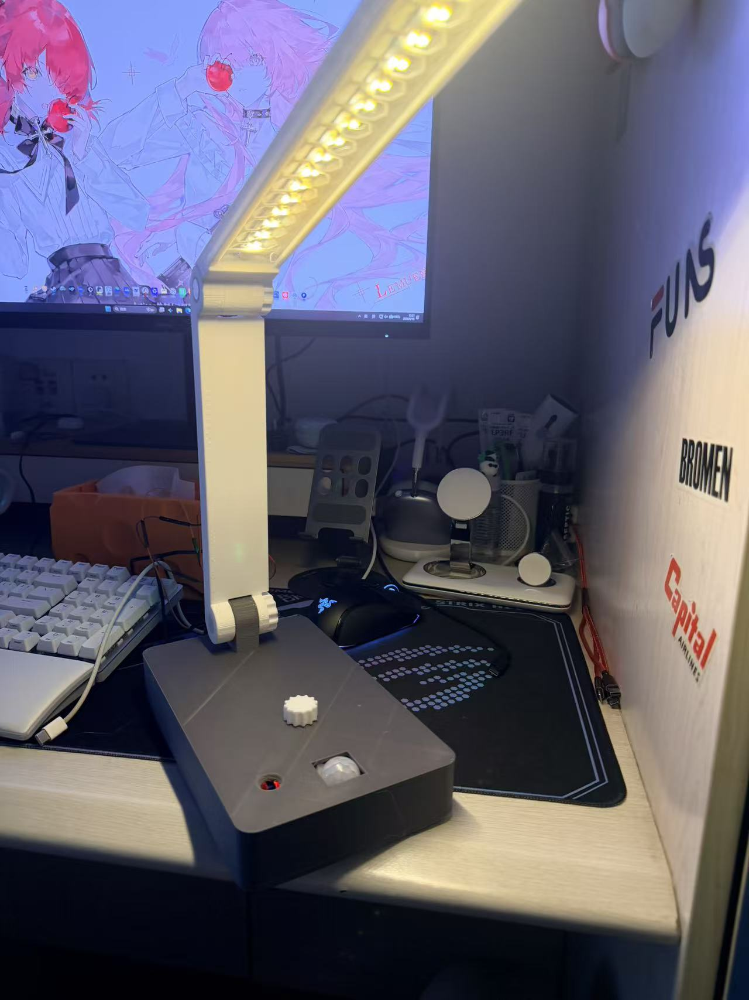
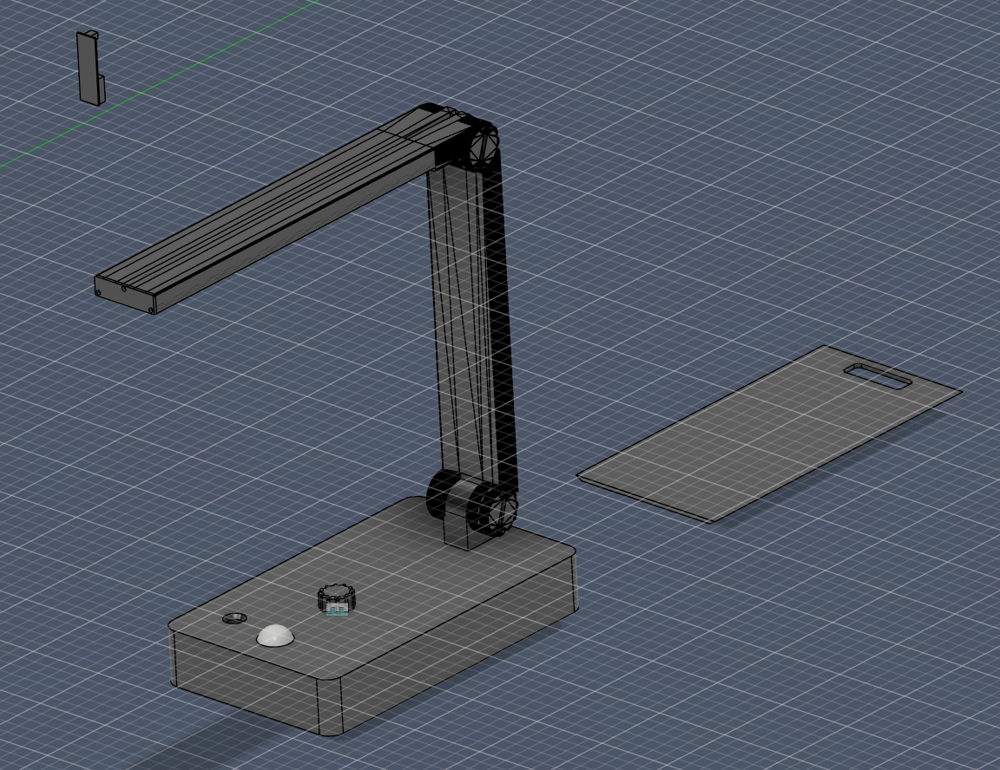

# SRTP 智能感应灯

> 三模式智能感应 LED 灯

---

### 静态效果展示

---

### 手动部分展示
<video controls src="视频演示/手动操作.mp4" title="Title"></video>
<video controls src="视频演示/完整灯手动.mp4" title="Title"></video>
---

### 自动部分展示

---

### 软件成果展示

```
SRTP_LED/
├── README.md                 # 本文档 — 成果展示
├── images/                   # 图片资源
│   ├── overview.jpg
│   ├── wiring-diagram.png
│   ├── state-machine.png
│   └── modules/              # 模块特写
├── Core/
│   ├── Src/
│   │   ├── main.c            # 主程序 — 模式状态机
│   │   ├── ky040.c           # 编码器驱动
│   │   ├── mosfet.c          # PWM 驱动
│   │   ├── ldr.c             # 光敏采样
│   │   ├── pir.c             # 人体感应
│   │   └── sound.c           # 声音感应
│   └── Inc/                  # 头文件
├── Drivers/                  # HAL + CMSIS 驱动库
└── SRTP_LED.ioc              # CubeMX 配置
```

---

### 建模成果展示




